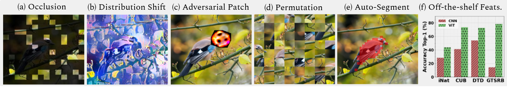

# Intriguing Properties of Vision Transformers

[Muzammal Naseer](https://scholar.google.ch/citations?user=tM9xKA8AAAAJ&hl=en),
[Kanchana Ranasinghe](https://scholar.google.com/citations?user=K2WBZTwAAAAJ),
[Salman Khan](https://scholar.google.com/citations?user=M59O9lkAAAAJ&hl=en),
[Munawar Hayat](https://scholar.google.ch/citations?user=Mx8MbWYAAAAJ&hl=en&oi=ao), 
[Fahad Khan](https://scholar.google.ch/citations?user=zvaeYnUAAAAJ&hl=en&oi=ao), &
[Ming-Hsuan Yang](https://scholar.google.com/citations?user=p9-ohHsAAAAJ&hl=en)

**[arxiv link](https://arxiv.org/abs/2105.10497)** 



> **Abstract:** 
>*Vision transformers (ViT) have demonstrated impressive performance across various machine vision tasks. These models are based on multi-head self-attention mechanisms that can flexibly attend to a sequence of image patches to encode contextual cues. An important question is how such flexibility (in attending image-wide context conditioned on a given patch) can facilitate handling nuisances in natural images e.g., severe occlusions, domain shifts, spatial permutations, adversarial and natural perturbations. We systematically study this question via an extensive set of experiments encompassing three ViT families and provide comparisons with a high-performing convolutional neural network (CNN). We show and analyze the following intriguing properties of ViT: (a) Transformers are highly robust to severe occlusions, perturbations and domain shifts, e.g., retain as high as 60% top-1 accuracy on ImageNet even after randomly occluding 80% of the image content.  (b) The robust performance to occlusions is not due to a bias towards local textures, and ViTs are significantly less biased towards textures compared to CNNs. When properly trained to encode shape-based features, ViTs demonstrate shape recognition capability comparable to that of human visual system, previously unmatched in the literature. (c) Using ViTs to encode shape representation leads to an interesting consequence of accurate semantic segmentation without pixel-level supervision. (d) Off-the-shelf features from a single ViT model can be combined to create a feature ensemble, leading to high accuracy rates across a range of classification datasets in both traditional and few-shot learning paradigms.  We show effective features of ViTs are due to flexible and dynamic receptive fields possible via self-attention mechanisms. Our code will be publicly released.* 

### We are in the process of cleaning our code. We will update this repo shortly. Here are the highlights of what to expect :)

1) ~~Pretrained ViT models trained on Stylized ImageNet (along with distilled ones). We will provide code to use these models for auto-segmentation~~.
2) ~~Training and Evaluations for our proposed off-the-shelf ensemble features.~~
3) ~~Code to evaluate any model on our proposed occulusion stratagies (random, foreground and background).~~ 
4) ~~Code for evaluation of permutation invaraince.~~ 
5) ~~Pretrained models to study the effect of varying patch sizes and positional encoding.~~
6) Pretrained adversarial patches and code to evalute them.
7) Training on Stylized Imagenet.

## Requirements
```bash
pip install -r requirements.txt
```


## Shape Biased Models
Our shape biased pretrained models can be downloaded from [here](). Code for evaluating their shape bias using auto
segmentation on the PASCAL VOC dataset can be found under scripts. Please fix any paths as necessary. You may place 
the VOC devkit folder under `data/voc` of fix the paths appropriately.

Running segmentation evaluation on models: 
```bash
./scripts/eval_segmentation.sh
```

Visualizing segmentation for images in a given folder:
```bash
./scripts/visualize_segmentation.sh
``` 


## Off the Shelf Classification
Training code for off-the-shelf experiment in `classify_metadataset.py`. Seven datasets (aircraft CUB DTD fungi GTSRB Places365 INAT) available by default. Set the appropriate dir path in `classify_md.sh` by fixing `DATA_PATH`. 

Run training and evaluation for a selected dataset (aircraft by default) using selected model (DeiT-T by default):
```bash
./scripts/classify_md.sh
```

## Occlusion Evaluation
Evaluation on ImageNet val set (change path in script) for our proposed occlusion techniques:
```bash
./scripts/evaluate_occlusion.sh
```

## Permutation Invariance Evaluation
Evaluation on ImageNet val set (change path in script) for the shuffle operation:
```bash
./scripts/evaluate_shuffle.sh
```


## Varying Patch Sizes and Positional Encoding
Pretrained models to study the effect of varying patch sizes and positional encoding: 
| DeiT-T Model 	| Top-1 	| Top-5 	| Pretrained 	|
|:------------:	|:-----:	|:-----:	|:----------:	|
| No Pos. Enc. 	|  68.3 	|  89.0 	|    [Link](https://github.com/Muzammal-Naseer/Intriguing-Properties-of-Vision-Transformers/releases/download/v0/no_pos_deit_t.pth)    	|
|   Patch 22   	|  68.7 	|  89.0 	|    [Link](https://github.com/Muzammal-Naseer/Intriguing-Properties-of-Vision-Transformers/releases/download/v0/patch_22_deit_t.pth)    	|
|   Patch 28   	|  65.2 	|  86.7 	|    [Link](https://github.com/Muzammal-Naseer/Intriguing-Properties-of-Vision-Transformers/releases/download/v0/patch_28_deit_t.pth)    	|
|   Patch 32   	|  63.1 	|  85.3 	|    [Link](https://github.com/Muzammal-Naseer/Intriguing-Properties-of-Vision-Transformers/releases/download/v0/patch_32_deit_t.pth)    	|
|   Patch 38   	|  55.2 	|  78.8 	|    [Link](https://github.com/Muzammal-Naseer/Intriguing-Properties-of-Vision-Transformers/releases/download/v0/patch_38_deit_t.pth)    	|


## References
Code borrowed from [DeiT](https://github.com/facebookresearch/deit) and [DINO](https://github.com/facebookresearch/dino) repositories as well as [TIMM](https://github.com/rwightman/pytorch-image-models) library. We thank them for their wonderful code bases. 


## Citation
```bibtex
@misc{naseer2021intriguing,
      title={Intriguing Properties of Vision Transformers}, 
      author={Muzammal Naseer and Kanchana Ranasinghe and Salman Khan and Munawar Hayat and Fahad Shahbaz Khan and Ming-Hsuan Yang},
      year={2021},
      eprint={2105.10497},
      archivePrefix={arXiv},
      primaryClass={cs.CV}
}
```